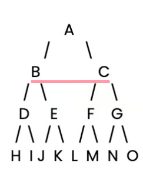

# Breath First Search

BFS can track distance implicitly by grouping all nodes of the same depth (given by the length of the queue) into a single while iteration.

```
...
queue = deque([(x0, y0)])
maze[x0][y0] = "+"
distance = 0

while queue:
    distance += 1
    for _ in range(len(queue)):
        x, y = queue.popleft()
        ...
```

## Python Implementation

Tree defined in dictionary

```
# Define the decision tree as a dictionary
tree = {
    'A': ['B', 'C'],  # Node A connects to B and C
    'B': ['D', 'E'],  # Node B connects to D and E
    'C': ['F', 'G'],  # Node C connects to F and G
    'D': ['H', 'I'],  # Node D connects to H and I
    'E': ['J', 'K'],  # Node E connects to J and K
    'F': ['L', 'M'],  # Node F connects to L and M
    'G': ['N', 'O'],  # Node G connects to N and O
    'H': [], 'I': [], 'J': [], 'K': [],  # Leaf nodes have no children
    'L': [], 'M': [], 'N': [], 'O': []   # Leaf nodes have no children
}
```

Tree



Python Implementation

```
from collections import deque  # Import deque for efficient queue operations

# Define the BFS function
def bfs(tree, start):
    visited = []  # List to keep track of visited nodes
    queue = deque([start])  # Initialize the queue with the starting node

    while queue:  # While there are still nodes to process
        node = queue.popleft()  # Dequeue a node from the front of the queue

        if node not in visited:  # Check if the node has been visited
            visited.append(node)  # Mark the node as visited
            print(node, end=" ")  # Output the visited node

            # Enqueue all unvisited neighbors (children) of the current node
            for neighbor in tree[node]:
                if neighbor not in visited:
                    queue.append(neighbor)  # Add unvisited neighbors to the queue
```
